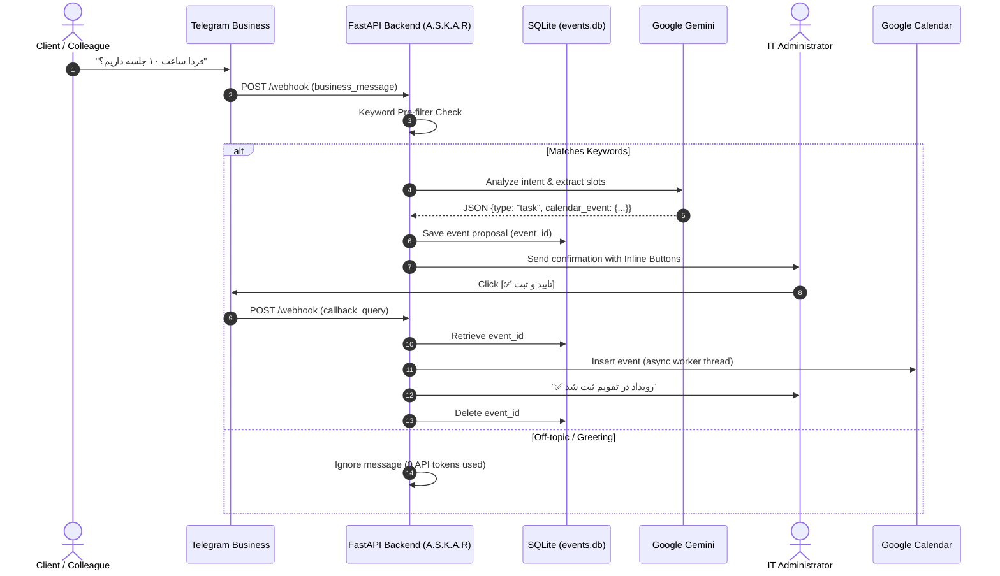

# 🤖 A.S.K.A.R — Intelligent IT Assistant & Calendar Bot

[](https://www.python.org/downloads/)
[](https://fastapi.tiangolo.com)
[](https://ai.google.dev)
[](https://developers.google.com/calendar)
[](https://opensource.org/licenses/MIT)

**A.S.K.A.R** (*Automated System for Knowledge, Assistance & Requests*) is an intelligent backend service designed for **Telegram Business** accounts. Built with **FastAPI**, **Google Gemini AI**, and **Google Calendar API**, it acts as an autonomous tier-1 IT helpdesk agent and smart scheduling assistant with a **Human-in-the-Loop (HITL)** verification flow.

---

## 📑 Table of Contents
- [Key Features](#-key-features)
- [How It Works](#-how-it-works)
- [Architecture & Flow](#-architecture--flow)
- [Prerequisites](#-prerequisites)
- [Installation & Setup](#-installation--setup)
- [Configuration (.env)](#-configuration-env)
- [Google Calendar Service Account Setup](#-google-calendar-service-account-setup)
- [Running the Application](#-running-the-application)
- [Setting Up the Telegram Webhook](#-setting-up-the-telegram-webhook)
- [Project Structure](#-project-structure)
- [Roadmap](#-roadmap)

---

## ✨ Key Features

1. **Telegram Business Integration**: Listens to incoming direct customer/staff chats via Telegram's `business_message` API.
2. **AI-Powered IT Helpdesk (FAQ)**: Automatically identifies common IT problems (Wi-Fi access, printer jams, forgotten credentials, network drops) and generates conversational, technical replies in friendly Persian.
3. **Smart Meeting & Task Extraction**: Analyzes unstructured text (e.g. *"فردا ساعت ۱۰ جلسه سرور داریم"*) and extracts structured start/end ISO timestamps.
4. **Human-in-the-Loop (HITL) Calendar Booking**: Rather than creating events automatically, proposals are sent to an Admin Telegram chat with interactive inline buttons (`✅ تایید و ثبت` / `❌ رد`).
5. **Token Cost Optimization**: High-speed keyword pre-filtering (`should_process_message`) ensures casual chit-chat, greetings, and off-topic messages are rejected locally without consuming Gemini API tokens.
6. **Persistent State Management**: Built-in SQLite database (`events.db`) persists pending calendar approvals with automatic TTL cleanup after 48 hours.
7. **Non-Blocking Asynchronous Architecture**: Synchronous Google API calls run in worker threads (`asyncio.to_thread`) while Telegram API calls utilize connection pooling with a shared `httpx.AsyncClient`.

---

## 🔄 Architecture & Flow



---

## 📦 Prerequisites

- **Python 3.10+** (Tested on Python 3.10 – 3.14)
- **Telegram Bot Token** (Obtained from [@BotFather](https://t.me/BotFather))
- **Telegram Business Account** with the bot connected under `Settings > Telegram Business > Chatbots`
- **Google Gemini API Key** (Obtained from [Google AI Studio](https://aistudio.google.com))
- **Google Cloud Service Account** with Google Calendar API enabled

---

## 🛠️ Installation & Setup

### 1. Clone the repository
```bash
git clone https://github.com/daadoonet/A.S.K.A.R.git
cd A.S.K.A.R
```

### 2. Create and activate a virtual environment
```bash
# Windows
python -m venv venv
venv\Scripts\activate

# Linux / macOS
python3 -m venv venv
source venv/bin/activate
```

### 3. Install dependencies
```bash
pip install -r requirements.txt
```

---

## ⚙️ Configuration (.env)

Copy the example configuration file:
```bash
cp .env.example .env
```

Edit `.env` with your credentials:

```env
# Telegram Bot Token from @BotFather
TELEGRAM_BOT_TOKEN=1234567890:ABCdefGhIJKlmNoPQRsTUVwxyZ

# Telegram numeric Chat ID of the IT Administrator
ADMIN_CHAT_ID=123456789

# Google Gemini API Key
GEMINI_API_KEY=AIzaSyYourGeminiApiKeyHere
GEMINI_MODEL=gemini-2.5-flash

# Google Calendar ID:
# Use 'primary' or your Google Account email (e.g., admin@gmail.com).
# DO NOT paste an embed URL (https://calendar.google.com/...)!
GOOGLE_CALENDAR_ID=primary

# Local Timezone
TIMEZONE=Asia/Tehran
```

---

## 📅 Google Calendar Service Account Setup

1. Go to the [Google Cloud Console](https://console.cloud.google.com/).
2. Create a project and enable the **Google Calendar API**.
3. Go to **APIs & Services > Credentials** and create a **Service Account**.
4. Create a JSON Key for this Service Account, download it, and save it in the project root as `credentials.json`.
5. Open your Google Calendar in a browser:
   - Go to **Calendar Settings > Share with specific people or groups**.
   - Add the Service Account email (e.g., `bot-service@your-project.iam.gserviceaccount.com`) with **Make changes to events** permission.

---

## 🚀 Running the Application

### Development mode:
```bash
uvicorn main:app --reload --port 8000
```

### Production mode:
```bash
uvicorn main:app --host 0.0.0.0 --port 8000 --workers 2
```

---

## 🌐 Setting Up the Telegram Webhook

Because Telegram requires an HTTPS webhook endpoint, you can expose your local server using a tunneling tool like **ngrok** or **Cloudflare Tunnel**:

```bash
ngrok http 8000
```

Copy the HTTPS forwarding address and register the webhook with Telegram (including the optional security `secret_token` configured in your `.env`):

```bash
curl -F "url=https://your-domain.ngrok-free.app/webhook" \
     -F "secret_token=your_optional_secret_token" \
     https://api.telegram.org/bot<YOUR_TELEGRAM_BOT_TOKEN>/setWebhook
```

> [!TIP]
> Setting `secret_token` ensures that only authorized requests originating directly from Telegram's servers (`X-Telegram-Bot-Api-Secret-Token`) can trigger your webhook endpoint.

> [!NOTE]
> Ensure the URL ends cleanly with `/webhook` and does not include accidental trailing backslashes (`\`).

---

## 📁 Project Structure

```
A.S.K.A.R/
├── .env.example              # Environment variable template
├── .gitignore                # Excludes secrets, databases, logs, and cache
├── credentials.json          # Google Cloud Service Account credentials (DO NOT COMMIT)
├── knowledge_base.json       # Private Wi-Fi passwords, FAQs, and Q&A (DO NOT COMMIT)
├── knowledge_base.json.example # Template for knowledge base configuration
├── events.db                 # Local SQLite database for pending calendar tasks & chat history
├── bot_activity.log          # Application logs with UTF-8 encoding
├── main.py                   # Main FastAPI server, Gemini client, & Telegram handlers
├── requirements.txt          # Python dependencies
├── TODO.md                   # Detailed feature roadmap and security checklist
└── README.md                 # Project documentation
```

---

## 🗺️ Roadmap & Next Steps

See [TODO.md](file:///d:/A.S.K.A.R/TODO.md) for upcoming improvements, including:
- Webhook secret token validation (`X-Telegram-Bot-Api-Secret-Token`).
- Multi-admin alerts support.
- Direct message `/start` and `/status` admin diagnostic commands.
- Docker & Docker Compose setup.


---

## 📄 License

This project is licensed under the MIT License — see the [LICENSE](LICENSE) file for details.

